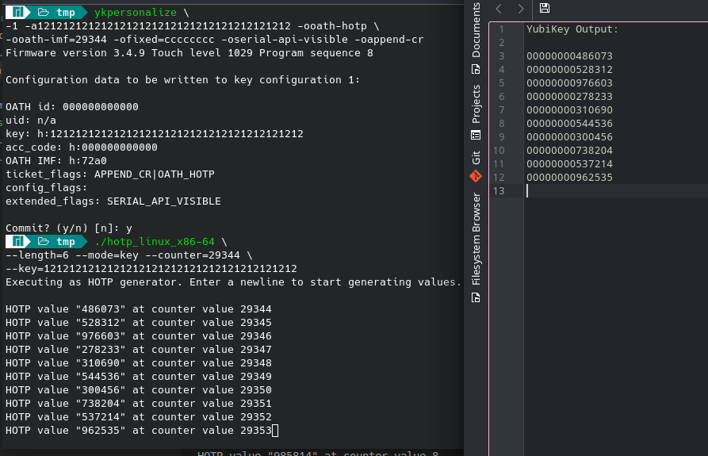
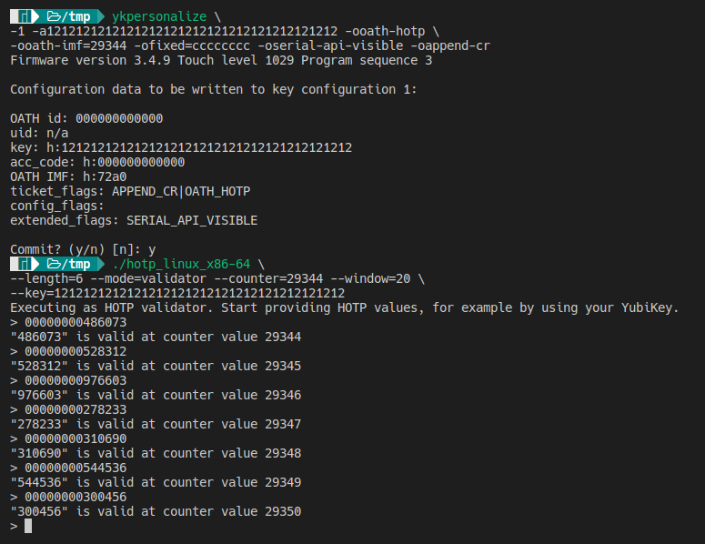

# Übungsblatt 5

## Aufgabe 2: HOTP (Praxisaufgabe)

HMAC-SHA1 ist in
[hmac.rs](exercise_2/src/hmac.rs)
implementiert.\
HOTP ist in [hotp.rs](exercise_2/src/hotp.rs)
implementiert.\
[main.rs](exercise_2/src/main.rs) implementiert einen "YubiKey-Simulator" zum generieren von HOTP-Werten
und einen kommandozeilen-basierten HOTP Validator.

Eine kompilierte Linux x86-64 Binary kann von
[hier](exercise_2/assets/hotp_linux_x86-64?raw=true) heruntergeladen werden.\
Zum selbst kompilieren ist es ausreichend, `cargo build --release` auszuführen.

### Kommandozeilen-Parameter

Das Programm kann mit Kommandozeilen-Argumenten ausgeführt werden, um es zu konfigurieren. Valide Schreibweisen zum
Konfigurieren der HOTP-Wert-Länge sind beispielweise `--length=6` und `-l6`.

Die folgenden Parameter werden akzeptiert. Unbekannte Parameter-Namen/Kurzformen werden ignoriert, ungültige Werte führen zur Ausgabe eines Fehlers und zum Ausführungsabbruch.

| Name      | Kurzform | Beschreibung                                         | Default               |
| :-------- | :------- | :--------------------------------------------------- | :-------------------- |
| --mode    | -m       | Ausführungsmodus. Erlaubte Werte: "key", "validator" | "key"                 |
| --counter | -c       | Initialer Wert des HOTP Moving Factors. Integer >= 0 | 0                     |
| --key     | -k       | HOTP Secret Key. Bytes als Hex-String                | 0000...0 (40 Zeichen) |
| --length  | -l       | HOTP-Wert-Länge. Integer >= 0                        | 6                     |
| --window  | -w       | Fenster-Größe für den Validator                      | 20                    |

### Ausführungmodi

#### Als YubiKey-Simulator (HOTP-Generator)

Im `key`-Modus gibt das Programm für jede Eingabe eines Zeilenumbruchs einen HOTP-Wert aus. Es beginnt mit dem
konfigurierten Counter-Wert und erhöht den Wert dann stets um 1.
Ein mit
```
ykpersonalize \
-1 -a1212121212121212121212121212121212121212 -ooath-hotp \
-ooath-imf=29344 -ofixed=cccccccc -oserial-api-visible -oappend-cr
```
konfigurierter YubiKey ist äquivalent zu dem mit
```
./hotp_linux_x86-64 \
--length=6 --mode=key --counter=29344 \
--key=1212121212121212121212121212121212121212
```
ausgeführten Programm.



#### Als HOTP Validator

Im `validator`-Modus überprüft das Programm eingegebene HOTP-Werte auf Validität über die konfigurierte Fenstergröße. Alle Zeichen einer Eingabezeile bis auf die letzten `length` Zeichen werden dabei ignoriert, sodass das Programm direkt gegen einen "echten" YubiKey getestet werden kann.

Ein mit
```
ykpersonalize \
-1 -a1212121212121212121212121212121212121212 -ooath-hotp \
-ooath-imf=29344 -ofixed=cccccccc -oserial-api-visible -oappend-cr
```
konfigurierter YubiKey erzeugt mit
```
./hotp_linux_x86-64 \
--length=6 --mode=validator --counter=29344 --window=20 \
--key=1212121212121212121212121212121212121212
```
validierbare HOTP-Werte.


